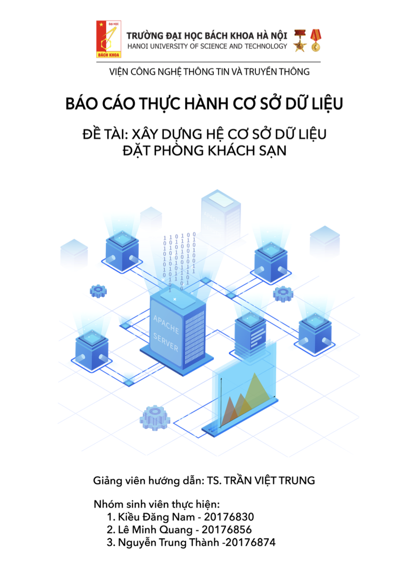

# Hotel Reservation Database Lab Project

The main highlight of this Hotel Reservation is the `project_create_table.sql` and `project_insert.sql` resources for managing databases and database data. Providers for MySQL. See usage documentation below.

## Report 

 |Database Lab Report - [PDF View](https://github.com/thanhhff/hotel-database/blob/master/Report/Database%20Lab%20Report.pdf)|
|:--:|
||

## 1. Introduction 
- **Members**

| |Full Name|Student ID|
|:--:|:--|:--:|
| 1 | [Kieu Dang Nam](https://github.com/dangnam739) | 20176830 |
| 2 | [Le Minh Quang](https://github.com/lequang-hp) | 20176856 |
| 3 | [Nguyen Trung Thanh](https://github.com/thanhhff) | 20176874 |

- **Database Name**: Hotel Reservation 

- **Database Diagram** 

- **Advantages**
    - Help you to built a Holtel Booking System.
    - Manage hotel reservations.
    - Gather information about hotel reservation need.
    - Recommend strategy of development of Hotel.
- **Disadvantages**
    - Simple database.
## 2. Create Database
-  [**Create Tables**](https://github.com/thanhhff/hotel-database/blob/master/project_create_table.sql)
    - locations: Bảng khu vực (lưu thông tin về các tỉnh, thành phố).
        - location_id : Khóa chính, dùng để xác định mã của các tỉnh, thành phố
        - city : tên của tỉnh, thành phố tương ứng với location_id
    - Hotels: Bảng lưu thông tin về các khách sạn.
        - hotel_id : Khóa chính, dùng để xác định khách sạn.
        - hotel_name : Tên khách sạn
        - location_id : Khóa ngoại liên kết với bảng locations để xác định khu vực của khách sạn
    - Sections: Bảng lưu đặc điểm của mỗi phòng.
        - section_id : Khóa chính, dùng để xác định các sections
        - hotel_id : vừa là khóa chính cùng với section_id và là khóa ngoại liên kết đến bảng Hotels, dùng để xác định xem sections đó thuộc khách sạn nào
        - room_type : Thể loại của phòng (phòng Đơn, Đôi, Ba, Tổng thống,...)
    - Sales: Bảng lưu thông tin khuyến mại tương ứng với mỗi phòng thuộc khách sạn.
        - sale_id : Khóa chính, xác định loại khuyến mại
        - apply_month : Tháng áp dụng khuyến mại
        - sale_percent : Phần trăm giảm giá.
    - Rooms: Bảng lưu thông tin các phòng.
        - room_id : Khóa chính, xác định số hiệu phòng
        - hotel_id, section_id : vừa lá khóa chính, vừa là khóa ngoại liên kết đến bảng sections để xác định loại sections tương ứng với mỗi phòng.
        - sale_id : Khóa ngoại liên kết đến bảng sales, dùng để xác định loại khuyến mại áp dụng cho phòng đó
        - floor : vị trí tầng của phòng.
    - Customers: Bảng lưu thông tin của khách hàng
        - custormer_id : Khóa chính, dùng để xác định khách hàng
        - name : Tên của khách hàng
        - email : Email của khách hàng
        - phone_number : Số điện thoại của khách hàng
        - location_id : Khóa ngoại liên kết đến bảng locations để lưu thông tin về khu vực mà khách hàng đó sinh sống
        - gender : Giới tính của khách hàng
    - Reservations: Bảng lưu thông tin các lần đặt phòng
        - reservation_id : Khóa chính, dùng để xác định đơn đặt phòng của khách hàng
        - customer_id : Khóa ngoại, liên kết đến bảng Customers để xác định khách hàng đặt phòng
        - room_id, hotel_id, section_id: Khóa ngoại liên kết tời bảng rooms để xác định phòng được đặt
        - day_start : Ngày bắt đầu đặt phòng
        - day_end : Ngày trả phòng.
        - price : Giá phòng
  
- [**Insert data into tables**](https://github.com/thanhhff/hotel-database/blob/master/project_insert.sql)

## 3. Queries

- [**Thanh's Queries**](https://github.com/thanhhff/hotel-database/blob/master/Query/Thanh_query.sql)

- [x] 1. Đưa ra Tên Khách Sạn, Tháng, % Sale mà khách sạn đó có sale_percent lớn nhất, sắp xếp theo thứ tự giảm dần sale_percent.
- [x] 2. Đưa ra Tên Khách Sạn, Địa Chỉ Khách Sạn, Giá Phòng có loại phòng KING rẻ nhất.
- [x] 3. Đưa ra Loại Phòng mà các khách hàng giới tính NAM có xu hướng đặt.
- [x] 4. Thống kê các Loại Phòng mà các khách sạn hiện có, sắp xếp theo tổng số lượng đặt phòng giảm dần. Yêu cầu in ra Tên Khách Sạn, Các Loại Phòng, Tổng Số Lượng Phòng đã được đặt.
- [x] 5. Đưa ra Tên Khách Hàng sống ở Hải Phòng mà đặt phòng khách sạn ở Hà Nội. Yêu cầu đưa thêm Tên Khách Sạn đã ở.
- [x] 6. Đưa ra Tên Khách Hàng, Địa Chỉ Khách Hàng, Ngày Bắt Đầu, Ngày Kết Thúc, Thời Gian của khách hàng đã từng ở khách sạn JW Marriott Hanoi trong khoảng thời gian từ đầu tháng 01 / 2019 đến hết tháng 5 / 2019.
- [x] 7. Đưa ra Số Lượng khách NAM và khách NỮ đặt phòng trong 4 tháng đầu năm 2019.
- [x] 8. Đưa ra Tên Khách Sạn, Địa Chỉ Khách Sạn, Số Lượng Đặt, Địa Chỉ Khách Hàng Từ Tỉnh Khác đến thuê.
- [x] 9. Đưa ra Tên Khách Hàng ở Hà Nội thuê nhiều khách sạn nhất.
- [x] 10. Đưa ra Tên Tỉnh Thành, Mức Chi Tiêu Trung Bình của người dân trong mỗi tỉnh thành trên cả nước, sắp xếp theo thứ tự chi tiêu giảm dần.

- [**Quang's Queries**](https://github.com/thanhhff/hotel-database/blob/master/Query/Quang_query.sql)

- [x] 1.	Lấy ra tên khách sạn có loại phòng ‘president’ đc đặt nhiều nhất
- [x] 2.	Thống kê số lượng các khách sạn ở mỗi tỉnh
- [x] 3.	Kể id phòng đc thuê nhiều nhất tại khách sạn ‘Royal Hotel’ trong năm 2019
- [x] 4.	Tên khách hàng, Tên Khách sạn, id phòng giá rẻ nhất mà khách đã đặt trong trường hợp người này chỉ ở 3 ngày
- [x] 5.	Liệt kê các phòng đôi ở tầng 5 của khách sạn ‘Royal Hotel’
- [x] 6.	Tỉnh nào có nhiều người đặt phòng nhất trong tháng 6
- [x] 7.	Thống kê doanh thu các khách sạn trong 2019 theo chiều giảm dần
- [x] 8.	Đưa ra tên các khách sạn ở Hà Nội và id các phòng chưa có người đặt ứng với các khách sạn đó trong tháng 12
- [x] 9.	Đưa ra tên khách hàng,tên các khách sạn đã ở, tổng chi phí họ phải trả cho việc đặt phòng
- [x] 10.	Liệt kê các khách hàng trong năm 2019 đã ở hơn 3 tỉnh khác nhau

- [**Nam's Queries**](https://github.com/thanhhff/hotel-database/blob/master/Query/Nam_query.sql)
- [x] 1.  Liệt kê số phòng được đặt nhiều nhất của từng khách sạn.
- [x] 2.  Đưa ra mức chi tiêu trung bình của khách hàng tương ứng với từng khách sạn trong năm 2019, sắp xếp theo chiều giảm dần.
- [x] 3.  Đưa ra  tên, tên khách sạn, số ngày ở lại và mức chi tiêu tương ứng của khách hàng có số ngày lưu lại tại khách sạn ở Hà Nội là lâu nhất.
- [x] 4.  Thống kê số lượt đặt phòng theo từng tháng, tổng số lượt đặt phòng của mỗi khách sạn trong năm 2019.
- [x] 5.  Đưa ra tên khách sạn có số lượng lượt đặt phòng nhiều nhất trong tháng 12/2019
- [x] 6.  Đưa ra danh sách các phòng ở tầng cao nhất của mỗi khách sạn.
- [x] 7.  Đưa ra đầy đủ thông tin của phòng có loại 'Double' và có mức giảm giá nhiều nhất trong tháng 12 ở Hà Nội.
- [x] 8.  Tính mức giảm giá trung bình của mỗi khách sạn trong tháng 1.
- [x] 9.  Đưa ra tổng số khách Nam, Nữ và tổng số khách đã từng đặt phòng tương ứng với mỗi khách sạn trước ngày 20/10/2019 theo thứ tự giảm dần.
- [x] 10. Đưa ra thông tin đầy đủ của các phòng, tên khách sạn tương ứng có từ 2 khách hàng trở lên đặt phòng trong tháng 2 hoặc tháng 12 tại Hà Nội.
